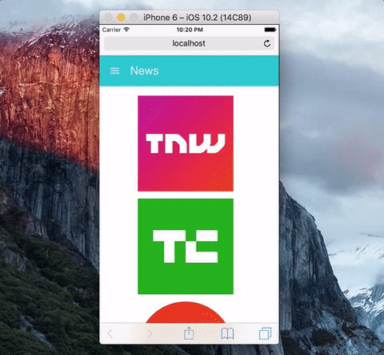

# What's this project?

This is a demo of PWA (Progressive Web App) based on [react-create-app](https://github.com/facebookincubator/create-react-app) and [create-react-pwa](https://github.com/jeffposnick/create-react-pwa). I made a simple demo about web app display technology news using API from [https://newsapi.org/](https://newsapi.org/).

# Development

This project I have included: redux, reactjs, redux-thunk, react-router & material-ui.

cd to directory contains ```package.json``` and run commands below:
```
npm i
```

```
npm start
```

And then go to [http://localhost:3000/](http://localhost:3000/)

## Learn more

 - [redux](https://github.com/reactjs/redux)
 - [redux-thunk](https://github.com/gaearon/redux-thunk)
 - [react-router](https://github.com/ReactTraining/react-router)
 - [material-ui](http://www.material-ui.com/#/)
 - [offline-js](http://github.hubspot.com/offline/docs/welcome/)

### Description

- `redux & redux-thunk`: To handle data flow
- `react-router`: To handle routing
- `material-ui`: To handle UI
- `offline-js`: To detect when user is in offline mode to display snackbar & change color of UI to gray color.

## Add to home screen

In this mode, you should get:
- **address bar**: disappear when you use your web app
- **touch icon**: you will see the icon of your web app on your home screen (on phone only)

### iOS

One note that. If you wish to have `Add to home screen` mode at iOS. You have to put the meta tags defined by Apple to you `<head>`. You can follow this url to make one: 

[https://developer.apple.com/library/content/documentation/AppleApplications/Reference/SafariWebContent/ConfiguringWebApplications/ConfiguringWebApplications.html](https://developer.apple.com/library/content/documentation/AppleApplications/Reference/SafariWebContent/ConfiguringWebApplications/ConfiguringWebApplications.html)

### Android

Android will use the `manifest.json` to handle `Add to home screen` mode. You can follow this url make one:

[https://developer.mozilla.org/en-US/docs/Web/Manifest](https://developer.mozilla.org/en-US/docs/Web/Manifest)

# Production

cd to directory contains ```package.json``` and run commands below:
```
npm run build
```

```
pushstate-server build
```

And then go to [http://localhost:9000/](http://localhost:9000/)

# Demo

## Demo 1

[https://www.youtube.com/watch?v=U35B31dBvBk](https://www.youtube.com/watch?v=U35B31dBvBk)

[](https://www.youtube.com/watch?v=U35B31dBvBk "Progressive web app demo")

## Demo 2
Color change when web app is in offline mode


## Demo 3
Touch icon in `Add to home screen` mode



# References

- [create-react-app](https://github.com/facebookincubator/create-react-app)

- [create-react-pwa](https://github.com/jeffposnick/create-react-pwa)

- [sw-toolbox](https://github.com/GoogleChrome/sw-toolbox)

- [https://jakearchibald.com/2014/offline-cookbook/#network-only](https://jakearchibald.com/2014/offline-cookbook/#network-only)

- [https://developer.mozilla.org/en-US/docs/Web/API/Service_Worker_API/Using_Service_Workers#Basic_architecture](https://developer.mozilla.org/en-US/docs/Web/API/Service_Worker_API/Using_Service_Workers#Basic_architecture)